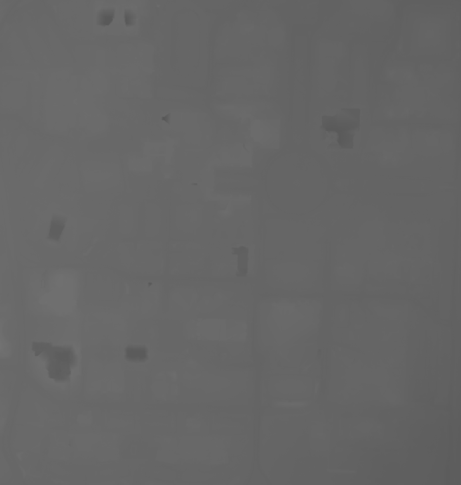

# Texas Tech University Flash Flood Simulation

## Scott Blechman and Fox Bolduc

## CS 4331 - Project 2

### Purpose
Using Apple's ARKit, we aim to create an app that will place players in the middle of a flash flood. Their objective, will be to reach a spot safe from the flood waters while avoiding the dangers of a flash flood such as deep and rapidly moving water. Players will be scored based on their ability to reach safety while avoiding these hazards.

### Tools Used

#### Apple ARKit
ARKit modeling is used both to visualize rising flood waters and to create elevation environment data used to coordinate water models. Other iOS utilities are used, including CoreLocation to coordinate elevation model creation.

#### National Elevation Dataset
All elevation data used in the creation of this app was taken from the National Elevation Dataset (available [here](https://viewer.nationalmap.gov/basic/?basemap=b1&category=ned,nedsrc&title=3DEP%20View)).

We used the most accurate data available in the Lubbock area, 1/3 arc-second, which provides us an elevation resolution of approximately 10 meters.

#### Blender
The elevation model meshes were modeled using Blender.

### Creating the Elevation Model
I began by downloading the 3DEP elevation data for Lubbock from the [National Elevation Dataset] (https://viewer.nationalmap.gov/basic/?basemap=b1&category=ned,nedsrc&title=3DEP%20View). I was able to view the data by opening it in [QGIS] (https://www.qgis.org/en/site/), an open source geographic information system program.

By overlaying the elevation data with open source street maps provided by QGIS, I was able to locate our area of play between Glenna Goodacre, 19th Street, University Avenue, and Flint Avenue. I took a screenshot of this area on the heightmap data which produced the following image.
.

I then followed the wonderfully informative [tutorial on John Flower's website](http://johnflower.org/tutorial/make-mountains-blender-height-maps) to convert the heightmap image to a 3D mesh.
.PNG) 

This provided a mesh of the entire play area. I then simply broke this larger model into the 49 chunks that can be loaded individually by the app.
.png)

### Creating the AR Environment
The elevation model represents an area of approximately 0.7x0.7 miles (3696x3696 ft). To create an even amount of sections, this area is divided into 49 chunks of 528 sq. ft. When the environment is created, the device location is used to calculate the corresponding chunk along with any bordering chunks. Location is checked periodically (about twice a minute, the average time to run across a chunk), to coordinate loading and unloading of models.

### Logic of the Game 
In a round, simulated water will rise to a final level higher than the initial elevation of the user. The user will have two minutes to determine what may be a safe location and arrive there. The score is calculated in two steps: an initial maximum score calculated using the final elevation, and points subtracted from entering dangerous situations (calculated using time spent in water greater than 6 inches above the elevation model, as well as any extra height of the water).
