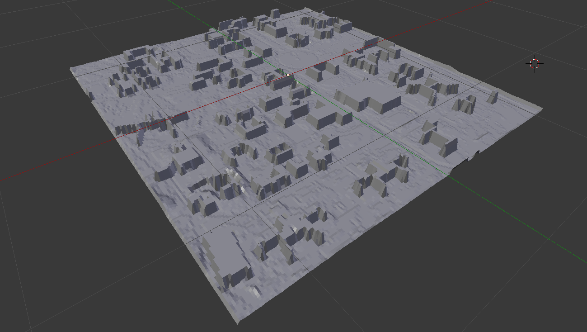

# Texas Tech University Flash Flood Simulation

## Scott Blechman and Fox Bolduc

## CS 4331 - Project 2

### Purpose
Using Apple's ARKit, we aim to create an app that will place players in the middle of a flash flood. The game's objective will be to reach a spot safe from the flood waters while avoiding the dangers of a flash flood such as deep and rapidly moving water. Players will be scored based on their ability to reach safety while avoiding these hazards.

### Tools Used
#### Xcode
The simulation is written natively in Swift 4. The system architecture is covered in the [Application Architecture](https://github.com/scottblechman/flood-safety-simulation#application-architecture) section. Available through the [Apple Developer Program](https://developer.apple.com/xcode/).

#### ARKit
Native iOS augmented reality library. Used to render simulated water over real-world terrain, and to include terrain models in the simulated world for more realistic water actions. More information can be found [here](https://developer.apple.com/arkit/).

#### National Elevation Dataset
All elevation data used in the creation of this app was taken from the National Elevation Dataset (NED), available [here](https://viewer.nationalmap.gov/basic/?basemap=b1&category=ned,nedsrc&title=3DEP%20View).

We used the most accurate data available in the Lubbock area, 1/3 arc-second, which provides us an elevation resolution of approximately 10 meters.

#### QGIS
A free, open source geographic information system (GIS). Available [here](https://www.qgis.org/en/site/)

#### GIMP
A free, open source image editing suite. Available [here](https://www.gimp.org/).

#### Blender
A free, open source 3D modeling and animation program. Available [here](https://www.blender.org/).

#### Python
A high-level programming language. Used to process elevation data retrieved from NED. Available [here](https://www.python.org/).

### Creating the Elevation Model
I began by downloading the 3DEP elevation data for Lubbock from the [National Elevation Dataset](https://viewer.nationalmap.gov/basic/?basemap=b1&category=ned,nedsrc&title=3DEP%20View). I was able to view the data by opening it in [QGIS](https://www.qgis.org/en/site/). By overlaying the elevation data with open source street maps provided by QGIS, I was able to locate our area of play between Glenna Goodacre, 19th Street, University Avenue, and Flint Avenue. I took a screenshot of this area on the heightmap data which produced the following image.


I then obtained a map of the campus that contains the locations of buildings and took a screenshot of the same area as my heightmap. 


I used [GIMP](https://www.gimp.org/) to isolate the blue buildings and made everything else transparent. I changed the blue to a color of grey appropriate to the hight of an average building on campus for our heightmap and overlayed the building image on the original heightmap, creating this hybrid height map.


I imported this height map to Blender as a texture and applied it as a distortion to a subdivided plane. I broke this plane into the 49 individual chunks that could be laoded by into our AR environment.


I exported these chunks individually as collada and ply models. Each chunk was named in the format chunk_x_y where chunk_0_0 correlates to the uppermost left corner.

### Gameplay Design
#### Objective
The objective of the player is to reach a safe location by the end of the simulation and place themselves in the least danger while doing so. Players will receive a numerical final score to reflect how well they achieved these goals. A score of greater than 100 indicates that they took minimal risks while reaching safety.

#### Scoring
Players begin with 120 points. On each game tick, we determine the water level at their location. Players will have points deducted based on the number of inches of water they are standing in. Deductions are shown in the table below:

| Water Level | Points Deducted |
| ----------- | --------------- |
| 0" - .9"    | 0               |
| 1" - 2.9"   | 1               |
| 3.3" - 5.9" | 5               |
| 6+"         | 20              |

#### Main Gameplay Loop
```
var elevation
var waterHeight
var waterLevel
var playerLocation
var gameTimer
var gameEnd

While(!gameEnd){
  playerLocation.update()
  elevation = playerLocation.elevation()
  waterHeight = playerLocation.waterHeight()
  waterLevel = waterHeight - elevation
  waterLevel = waterLevel * 39.3701 //converts meters to inches
  //scoring
  if (waterLevel < 1)
    score = score       //redundant but makes else ifs look nicer
  else if (waterLevel < 3)
    score -= 1
  else if (waterLevel < 6)
    score -= 5
  else
    score -= 20
  //check if game end
  if (score <= 0)
    gameEnd = true
  if (gameTimer >= timeLimit)
    gameEnd = true

  gameTimer += tickTime
}

score.display()
```

### Application Architecture

#### Creating the AR Environment
The elevation model represents an area of approximately 0.7x0.7 miles (3696x3696 ft). To create an even amount of sections, this area is divided into 49 chunks of approximately 528 sq. ft. The application contains .dae model files for each of the 49 chunks; those overlapping and adjacent to the user at a particular point in time are rendered to the AR scene. When the environment is created, the device location is used to calculate the corresponding chunk along with any bordering chunks. Location is checked periodically (after the user has moved approx. 1 meter), to coordinate loading and unloading of models as well as updating the score.

#### View
The primary view of the application is a single AR SceneView provided by ARKit. This view renders a preview from the rear camera, with a 3D SceneKit environment interacting with the world. Other UI components are overlaid on the SceneView at different points in the game lifecycle.

#### View Controller
The primary coordination component of the application. Responsible for all logic involving the 3D scene, including maintaining an outlet to the primary view and controlling the scene graph (adding and removing models of chunks into the world, controlling the water model position) relative to the perspective of the user. Sends and receives messages from the model subsystems to coordinate application state among the different components.

#### Location Subsystem
Uses the Swift CoreLocation library to maintain real-time tracking of the user's geographic location and heading (compass orientation accessed through the device magnometer). Controls initialization and authorization of the device location system for the application, and sends regular location and heading updates to the view controller for synchronization (described below).

#### Terrain Chunk Subsystem

**Note:** our team originally used a system of model chunks to allow for a potentially complex elevation model to be rendered over the entire campus area without causing issues to memory or performance. The elevation model we created ultimately had a small enough poly count to be rendered as a single model without causing major issues, and because of the drawbacks of the added complexity, deprecated the chunk subsystem. The following explains how the system was originally designed and implemented.

A "chunk" in the application represents a real-world area of elevation of approximately 528 sq. ft. A chunk is defined by its position in the overall terrain grid (0 ≤ x ≤ 6, 0 ≤ y ≤ 6), and contains information on the geographic coordinates and elevation of its "anchor point" (the top left corner of the chunk, used to align the chunk model in 3D space). The chunks themselves are simply references correlated to specific 3D models; the handling of the models themselved is performed by the view controller using the currently available chunk references.

A chunk manager coordinates with the view controller to provide information on which chunks should and should not be shown in the world. When requested, the chunk manager can use the device's current location to provide the view controller with references to the selected chunks (4 ≤ x ≤ 9) that should be shown in the AR scene.

#### Synchronizing the AR World
The view controller maintains a collection of the chunks it is currently rendering in the AR scene, using the chunk references provided by the chunk manager. When the device's location is updated, the chunks needed are updated internally to reflect the new location, and the view controller creates terrain geometry to match the new list, as well as removing previously added geometry that is no longer in the user's field of vision.

#### Current AR System
As we are able to render the campus elevation model as a single unit, the AR system has been simplified. We are able to render a block representing water below the campus model, which is initialized to be anchored at the corner of campus in real-world coordinates and uses the elevation of the device to start at the proper ground level. The water model slowly rises in elevation as the game state ticks (explained more below), and overlaps the terrain model, creating the effect of pooling water rising from lower elevations to higher ones

#### Creating the Game State
To keep the view controller's concerns limited to reading subsystem states and rendering UI and the AR world, logic related to keeping track of the in-game world (such as the water elevation) and performing scoring is abstracted to a game manager. The game manager is primarily responsible for setting up a timer to run for the duration of the game. On a timer tick, total water elevation is updated, and the elevation at the user's location is compared to the water level to determine if the score should be subtracted from. These ticks are communicated to the view controller through a delegate, which both allows for the AR scene and user interface to be updated and for information such as the user's location to be passed to the game manager.

#### User Interface and Effects
The user interface consists of 4 primary elements: a button presented at the start to begin the game, a view at the top of the screen showing information during gameplay, a modal view at the end of the game to present the final score, and a button below it to reset the game state. Because Xcode's Interface Builder does not allow for these UIKit components to be statically placed in the same view as the AR scene view, all of these elements are programatically defined, and and shown and hidden in response to certain game events.

Other audio and visual effects are also present to give the game a more realistic feel. A SceneKit particle system and core utility audio player are started and stopped together to provide the look and sound of heavy rain during gameplay.

### Division of Labor
#### Fox
- Create Elevation Model
  - Obtain GIS data for Texas Tech Campus
  - Create heightmap image
  - Create meshes from height map for use in ARKit
- Design Game Logic
  - Design scoring system
  - Write pseudocode for gameplay loop

#### Scott
- Create AR Environment
  - Set up AR play area on Texas Tech Campus
  - Make system to track user location and elevation
  - Create system to track active elevation model chunks
  - Render water level in real time
- Implement Gameplay
  - Create menus and transitions to and from gameplay
  - Implement gameplay logic from pseudocode

[Video Demo Link](https://www.youtube.com/watch?v=9bk4JiERLMo&feature=youtu.be)
