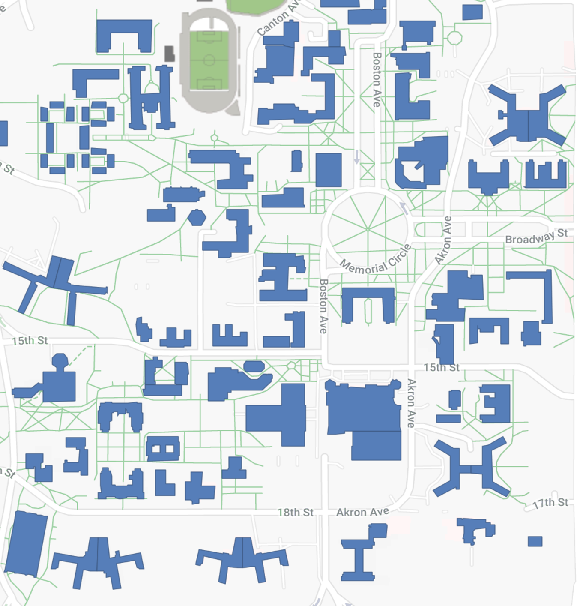

# Texas Tech University Flash Flood Simulation

## Scott Blechman and Fox Bolduc

## CS 4331 - Project 2

### Purpose
Using Apple's ARKit, we aim to create an app that will place players in the middle of a flash flood. Their objective, will be to reach a spot safe from the flood waters while avoiding the dangers of a flash flood such as deep and rapidly moving water. Players will be scored based on their ability to reach safety while avoiding these hazards.

### Tools Used
#### Apple ARKit
ARKit modeling is used both to visualize rising flood waters and to create elevation environment data used to coordinate water models. Other iOS utilities are used, including CoreLocation to coordinate elevation model creation.

#### National Elevation Dataset
All elevation data used in the creation of this app was taken from the National Elevation Dataset (NED), available [here](https://viewer.nationalmap.gov/basic/?basemap=b1&category=ned,nedsrc&title=3DEP%20View).

We used the most accurate data available in the Lubbock area, 1/3 arc-second, which provides us an elevation resolution of approximately 10 meters.

#### QGIS
A free, open source geographic information system (GIS). Available [here](https://www.qgis.org/en/site/)

#### GIMP
A free, open source image editing suite. Available [here](https://www.gimp.org/).

#### Blender
A free, open source 3D modeling and animation program. Available [here](https://www.blender.org/).

### Creating the Elevation Model
I began by downloading the 3DEP elevation data for Lubbock from the [National Elevation Dataset](https://viewer.nationalmap.gov/basic/?basemap=b1&category=ned,nedsrc&title=3DEP%20View). I was able to view the data by opening it in [QGIS](https://www.qgis.org/en/site/). By overlaying the elevation data with open source street maps provided by QGIS, I was able to locate our area of play between Glenna Goodacre, 19th Street, University Avenue, and Flint Avenue. I took a screenshot of this area on the heightmap data which produced the following image.


I then obtained a map of the campus that contains the locations of buildings and took a screenshot of the same area as my heightmap. 


I used [GIMP](https://www.gimp.org/) to isolate the blue buildings and made everything else transparent. I changed the blue to a color of grey appropriate to the hight of an average building on campus for our heightmap and overlayed the building image on the original heightmap, creating this hybrid height map.


I imported this height map to Blender as a texture and applied it as a distortion to a subdivided plane. I broke this plane into the 49 individual chunks that could be laoded by into our AR environment.


I exported these chunks individually as collada and ply models. Each chunk was named in the format chunk_x_y where chunk_0_0 correlates to the uppermost left corner.

### Creating the AR Environment
The elevation model represents an area of approximately 0.7x0.7 miles (3696x3696 ft). To create an even amount of sections, this area is divided into 49 chunks of 528 sq. ft. When the environment is created, the device location is used to calculate the corresponding chunk along with any bordering chunks. Location is checked periodically (about twice a minute, the average time to run across a chunk), to coordinate loading and unloading of models.

### Gameplay Design
#### Objective
The objective of the player is to reach a safe location by the end of the simulation and place themselves in the least danger while doing so. Players will receive a numerical final score to reflect how well they achieved these goals. A score of greater than 100 indicates that they took minimal risks while reaching safety.

#### Scoring
Players begin with 120 points. On each game tick (approximately every 5 seconds?), we determine the water level at their location. Players will have points deducted based on the number of inches of water they are standing in. Deductions are shown in the table below:

| Water Level | Points Deducted |
| ----------- | --------------- |
| 0" - .9"    | 0               |
| 1" - 2.9"   | 1               |
| 3.3" - 5.9" | 5               |
| 6+"         | 20              |

#### Main Gameplay Loop
```
var elevation
var waterHeight
var waterLevel
var playerLocation
var gameTimer
var gameEnd

While(!gameEnd){
  playerLocation.update()
  elevation = playerLocation.elevation()
  waterHeight = playerLocation.waterHeight()
  waterLevel = waterHeight - elevation
  waterLevel = waterLevel / 39.3701 //converts meters to inches
  //scoring
  if (waterLevel < 1)
    score = score       //redundant but makes else ifs look nicer
  else if (waterLevel < 3)
    score -= 1
  else if (waterLevel < 6)
    score -= 5
  else
    score -= 20
  //check if game end
  if (score <= 0)
    gameEnd = true
  if (gameTimer >= timeLimit)
    gameEnd = true

  gameTimer += tickTime //tickTime is approx. 5 seconds
}

score.display()
```
### Division of Labor
#### Fox
- Create Elevation Model
  - Obtain GIS data for Texas Tech Campus
  - Create heightmap image
  - Create meshes from height map for use in ARKit
- Design Game Logic
  - Design scoring system
  - Write pseudocode for gameplay loop

#### Scott
- Create AR Environment
  - Set up AR play area on Texas Tech Campus
  - Make system to track user location and elevation
  - Create system to track active elevation model chunks
  - Render water level in real time
- Implement Gameplay
  - Create menus and transitions to and from gameplay
  - Implement gameplay logic from pseudocode
